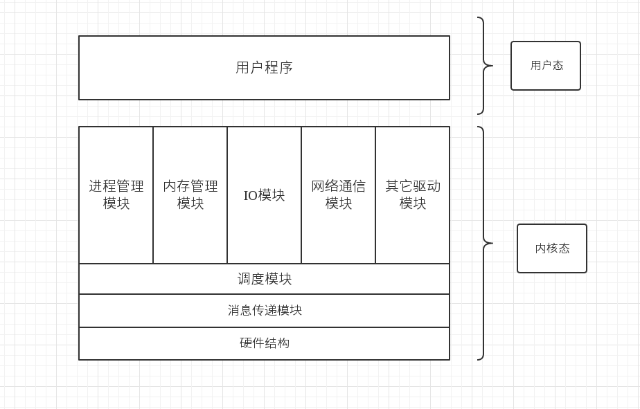
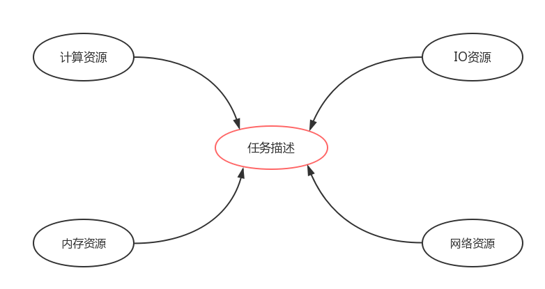
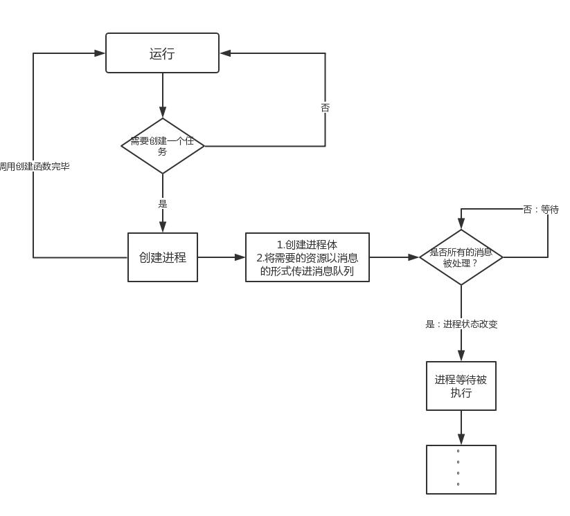

#第二章  ParalleX 综述

##2.1  内核与内核模块

###2.1.1 内核  （微内核或者宏内核？）
  
内核就是一套管理计算机的代码，是操作系统的核心，它帮助我们管理计算机的硬件与软件。我们的内核不论是采用什么样的结构，什么样的构思，目的只有一个，”提高效率，方便用户。”。

我们的内核采用“微内核”与“宏内核”结合的方式工作。以“消息传递模块”和“调度控制模块”构成控制系统。由控制系统根据每一个任务的需求合理的分配资源，高效的完成任务。但是，我们为什么这样设计？这是一个关乎整个系统最核心的问题。

先阶段我们使用的操作系统要么是宏内核的，要么是微内核的，但是他们又不全是纯正的各自的血统。因为设计操作系统其实可以说是天底下最要“折中”的事情，效率是衡量一个OS的重要指标，从最近的操作系统来看WINDOS总体是微内核的，LINUX是宏内核的。前者可以说是PC操作系统中的佼佼者，后者从90年代称霸服务器领域到现在，我们很评述到底哪个方式更加的好，不过现在一致的观点是LINUX效率更高，尤其是在LINUX诞生的那年，托瓦兹和鲍姆还因为内核的结构大吵了一架。最终以LINUX 获得事实性胜利获胜，但是我们能就能下定论“微内核”效率低于微内核吗？我们来粗略算一算。

以进程的一个生命周期来举例子：

对于宏内核来说：
  
    T（运行）  = T（创建） + T（调度） + T（工作）+ T（结束）
    
    这就是在宏内核中一个进程从创建到结束的整个生命周期。
    
对于微内核来说：

    T（运行）  = T（创建） + T（调度） + T（工作） + T（结束） + T（消息传递）
    
    微内核在这个比较的过程中确实多了一个消息处理的时间消耗。 
    
当然这只是一种最理想化的讨论，宏内核现在确实效率高些，并且实践的经验也确实如此。可是结束了吗？

现在经典计算机的发展朝向多核，众核的方向发展，并且内存的读写速度也一再提升。这只是硬件结构的发展，我们需求的应用程序的规模也逐渐变的很大，对于并行高速的计算有很大的需求。再这样的情况下宏内核一再扩展，为了适应支持这样的发展。导致的一个直接问题就是宏内核的结构变的庞杂，多模块之间互相引用，成了“牵一发而动全身的情况”。而对于多核的支持并不是特别的出众，未来我们的计算机很可能就不止是8核16核了，可能是真的由几十个CPU众多GPU的计算机。现在的超级计算机未来可能就会变的不再那么大，这是有历史可循的，再者未来的人工智能需要的计算能力很有可能需要直接接入进OS内部，当然这都是有点点远的事情了。

接着我们再考虑一个问题关于计算资源的问题 ，这个问题再未来多核，众核下必将是一个需要考虑的问题，其实在过去计算机只有一个两个核的时候，计算资源本质就是CPU时间的分配罢了，管理方式也相对的粗糙甚至说粗暴，中断。中断其实是对计算资源的一个相对公平的管理。但是面对未来的情况，多核，众核的情况下，计算资源就要被我们所考虑了，我们如果不能管理好计算的资源存储的资源对于计算机来说就是一种比较大的浪费了。

综上，本着探索的精神（对我来说仅仅是探索与求知的精神）设计之初就采取“微内核”+ “宏内核” 结构设计出这个内核。

###2.1.2 内核结构

内核还是分位用户态和内核态

内核态：
      
     进程管理模块：进程控制相关操作。
     
     内存管理模块：物理/虚拟内存管理。
     
     IO模块：包括文件系统的相关接口与操作。
     
     网络通信：先阶段只要是进程间通信。
     
     其它驱动：其它驱动程序。
     
     调度模块与消息模块:以上都是常规的模块，我们这里由两个模块调度模块和消息模块，着两个模块组成了内核的调度模块，一切凭消息的内容和相关算法进行调度工作。
     在多核情况下我们甚至直接可以将这个模块单独放在一个核上，由他控制全局的协调，达到充分利用多核的效果。
     开始阶段我们可以将它设置成为一个周期执行的调度部分，达到模拟的效果。
     
用户态：

     我们还是使用系统调用，通过系统调用让内核帮助我们来执行一些相关的任务。
     
###2.1.3 内核管理资源结构

####任务与资源的关系

我们的一个计算任务其实就是计算机执行我们对这个任务的描述，我们描述这个任务该如何执行，其实对于计算机科学来说最终的目的是使用计算来推导公式，定理让计算机自己思考，自己推导出结论是使用计算机来研究科学，但是现在计算机还没有那么智能，所以还需要我们描述计算任务的规则，然后它代替我们执行。所以一个任务可以描述为我们对于这个任务的描述，计算机负责管理自己的资源正确的执行我们设置的规则，做运算得出结果。

上图，就是我们定义的一个任务的描述。

####内核实际工作结构

#####内核工作简要流程图

以创建一个进程的创建为例。

#####多和模式下内核设计与内存设计

这是我们为多核调度的一个设计，包括内存结构。

对于多核的情况，设计一个CPU作为控制节点，主要完成消息的处理与调度模块功能，其它核就作为普通的工作CPU只需要被分配任务然后运行任务。思想如我们之前所概述的那样。
对于内存的处理，这里其实和多核的调度算法息息相关。不同的选择几乎可以采用完全不同的调度算法。后边介绍调度算法在扩展说明。

####内核模块简述：
我们的内核既然是按照消息传递的形式做了设计，那么我们的内核模块也应当是具有很高灵活性的，除了系统的默认几大模块，我们使用一个额外的外挂模块专门来管理我们编写的内核模块，达到管理我们实现自己定制功能的目的。

     
