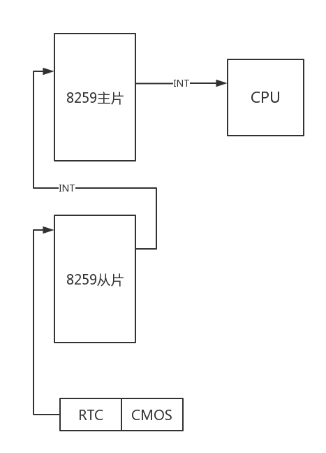
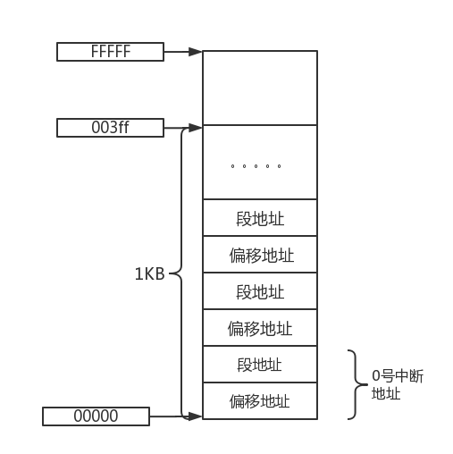
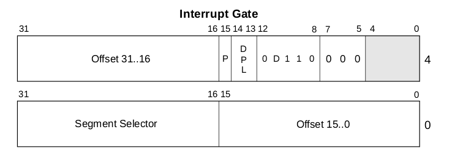
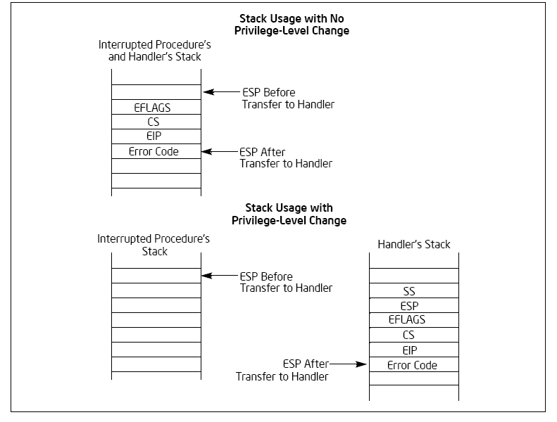

#3.x ParalleX  异常与中断

##中断的感性认识

在过去的时候，我指的20世纪中期，那个时候计算机非常昂贵，大家都想使用计算机的计算资源，为了分享计算机的计算资源，人们为了提供多用户多任务的功能，发明了一种新的机制，“中断机制”。中断就是在一定的时机下，打断计算机的正在执行的程序，调度另一个程序上CPU来执行，在一定时机后又会调度其它的程序运行或者返回之前的执行流程。以此来达到“多用户，多任务”的目的。后来这种机制就成为了处理器必备的机制，我也曾看到一种说法是：“操作系统就是中断驱动的”。

举个例子来讲，你正在写代码，但是你的朋友给你打电话了，这时候你就会暂停手上的工作起身去接电话，这就是发生了一次中断。接电话的任务打断了写代码的任务，发生了一次中断。

##中断的分类与解释

中断的实现是将相应电信号通过中断线发送给CPU，CPU的中断管脚并非只有一根，其实是有NMI和INTR两个管脚，因为从严重性上来看，中断是分为两类的，首先NMI管脚触发的中断是需要无条件立即处理的，这种类型的中断是不会被阻塞和屏蔽的，所以叫做非屏蔽中断（Non Maskable Interrupt，NMI）。事实上一旦产生了NMI中断，就意味着CPU遇到了不可挽回的错误，一般不会进行处理，只是给出一个错误信息。而我们之前所说的中断控制器连接的管脚叫做INTR，这类中断有两个特点，分别是数量多和可屏蔽。而我们主要关注的正是INTR中断。

中断分类为：

1.非屏蔽中断
Intel处理器规定，NMI中断信号由0跳变到1后，至少需要4个时钟周期才能被识别，每一种中断都被编上了号，称为中断类型号，中断向量号或者中断号，不可屏蔽中断一旦发生就是致命的，几乎很难自行修复，所以在实模式下，NMI统一被编号为2，不再进行细分，一单发生这种中断硬件和软件也不会尝试去做出努力，结束掉这个任务是一个不错的选择。

2.可屏蔽中断
和NMI不同，中断并不是意味着死亡与结束，我们可以将它做成有利于我们使用的东西，中断也是抢占的必要条件之一，我们当然也可以选择忽略中断。例如一个进程本来阻塞在读写IO的操作上，当读写操作完成以后，它又可以被运行了，由磁盘控制向CPU发送一个IO中断，当CPU收到这个中断时它就清楚了该将读写动作完成的进程调度上CPU运行了。以设备发出中断来举例的话，计算机的外设是很多的，我们如何做到分清并且处理好外设发生的中断呢。我们就需要使用8259芯片了（可编程中断控制器）。一张简单结构图：

3.内部中断
内部中断发生在处理器内部，是由执行的指令引起的，内部中断并不受IF位的影响，他们的中断类型式固定的，可以立即转入相应的处理程序。

4.软中断
软中断是由int指令引起的中断处理，这类中断也不需要识别中断周期，中断号在指令中给出。int的指令格式如下：
> int3
> int imm8
> into

int3是断点指令，这条指令在调试的时候很有用。
int num 是执行相应中断号的程序。
into 是检测缓冲区溢出的指令。

中断控制器结构由两个8259芯片级联，Inter处理器允许256个中断，范围是0～255，8259芯片只有8个中断输入引脚，个人计算机需要2块，总共可以处理15个中断信号，其中在8259芯片内部还有一个中断屏蔽寄存器IMR，是一个8位的寄存器，这个寄存器对应八个端口，0表示可以将中断送进CPU而1表示不可以，并且我们还需要看CPU的中断位是否设置位1.

##实模式下中断向量表

我们如果接收到了中断处理信息，如何处理这个信息，我们需要借助中断向量表来处理，我们的中断处理程序都加载在内存当中。我们只需要找到相应的程序地址然后执行就可以了。
在实模式下中断向量表有固定的位置，以BIOS为例我们可以看到BIOS的中断处理程序地址在地址0x00000开始整齐排列。一共256个中断，每一个中断由段地址：偏移地址组成一共占用1KB内存大小。

处理器在接到中断处理信号时需要做如下的事情：

1.保护断点现场。

2.执行中断处理程序。

3.返回到断点继续执行。

##保护模式下中断向量表

我们知道中断分为外部设备的硬中断，和CPU内部的软中断。这两种中断的区别是硬件中断完全是随机产生的，与处理器的执行步骤并不相同。当中断发生时，处理器需要先执行完当前的指令，然后才能对中断进行处理，软中断是由int n 指令引发的中断处理，n 是中断号或者叫类型码。

在保护模式下，处理器对于中断管理是相似的，但是并非使用传统的中断向量表，而是使用中断描述符表（IDT）。
包括16位的目标代码段选择子，以及32位的偏移量。中断们只能在IDT内，任务门可以位与GDT，LDT，IDT中。IDT和中断向量表不同，不需要在内存的最低端，有一个48位的中断描述符表寄存器IDTR用来存储中断描述符表的基地址。

中断描述符表的大小可以达到64KB但是CPU只能识别256个中断，所以其实最多只用2KB的大小，其它空余槽位清为0.其中IDT的第一个描述符也是有用的。

在发生中断时CPU具体处理方式：

1.根据处理程序的级别，从当前的任务TSS中取出栈段选择子，栈指针，处理器把旧的栈的选择子和栈指针压入新栈。

2.处理器把EFLAGS，CS，EIP 的当前状态压入新栈。

3.对于有错误代码和异常，处理器还要把错误代码压入新栈，紧紧在EIP后。

1.如果中段处理程序的特权级别和当前特权级别一致，则不会转换栈。

2.处理器把当前的EFLAGS，CS和EIP的当前状态压入当前栈。

3.对于有错误代码和异常，处理器还要把错误代码压入新栈，紧紧在EIP后。

##异常

异常就是我们上文之前说过的内部中断。他们是处理器内部产生的中断，表示遇到了非法的操作，例如除0或者TSS无效等等。

异常的分类：

第一种：程序错误引发的异常。

第二种：软件引发的异常。

第三种：机器检查引发的异常。

按照异常的严重程度我们又可以分为以下三种：

第一种：故障，一般可以纠正，例如缺页这也是虚拟内存必须的一个条件。

第二种：陷阱，一般可以用于调试和调用。

第三种：终止，严重错误终止任务，例如双重错误。

|向量号 |助记符 |  说明    |            类型  |   错误号 |    产生源|
|:------|:------|:-----------|:---------------|:----------|:---------|
|0     |#DE    |除出错               | 故障      |无      | DIV或IDIV指令
|1     |#DB    |调试                |           |无     |  
|2     | --   |NMI中断              | 中断      |无     | 非屏蔽外部中断
|3     |#BP    |断点                | 陷阱      |无      | INT 3指令
|4     |#OF    |溢出                | 陷阱      |无      | INTO指令
|5     |#BR  |边界范围超出             |故障     |无      |  BOUND指令
|6     |#UD  |无效操作码（未定义操作码） |故障     |无      | UD2指令或保留的操作码。（Pentium Pro中加入的新指令）
|7     |#NM   |设备不存在（无数学协处理器）|故障   | 无      | 浮点或WAIT/FWAIT指令
|8     |#DF   |双重错误               | 终止  |有（0）   |任何可产生异常、NMI或INTR的指令
|9     |--    |协处理器段超越（保留）  | 故障    |  无      |   浮点指令（386以后的CPU不产生该异常）
|10    |#TS   | 无效的任务状态段TSS   | 故障     | 有     |  任务交换或访问TSS
|11    |#NP   |段不存在              | 故障    |有        |  加载段寄存器或访问系统段
|12    |#SS   |堆栈段错误            | 故障     | 有      |   堆栈操作和SS寄存器加载
|13    |#GP   |一般保护错误          | 故障     | 有      |任何内存引用和其他保护检查
|14    |#PF   |页面错误             | 故障      |有       |  任何内存引用
|15    |-- |（Intel保留，请勿使用）    |       | 无|
|16    |#MF |x87 FPU浮点错误（数学错误）|故障    |无       | x87 FPU浮点或WAIT/FWAIT指令
|17    |#AC | 对起检查                | 故障  |有（0）   | 对内存中任何数据的引用
|18    |#MC  |机器检查               | 终止  | 无       | 错误码（若有）和产生源与CPU类型有关（奔腾处理器引进）
|19    |#XF  |SIMD浮点异常          |故障     |无       | SSE和SSE2浮点指令（PIII处理器引进）
|20-31 |-- |（Intel保留，请勿使用）|||
|32-255 |-- |用户定义（非保留）中断   |中断     |         |  外部中断或者INT n指令

