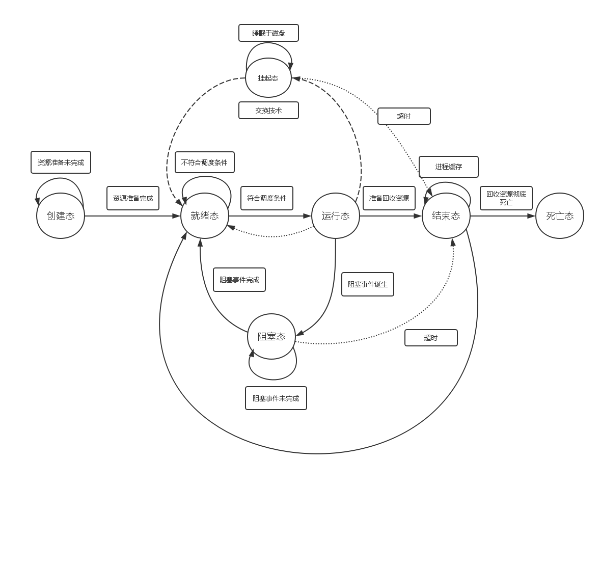

#4.1 通用进程概述及状态设计与讨论

这一节我们将具体讨论进程的描述，对进程的状态做具体的讨论，但是这里不涉及具体的实现方式。

###进程状态描述

进程的几种状态描述：




这里完全是从状态的角度分析了进程的状态描述，我们可以发现在进程的状态上，和传统的进程状态的区别并不是太大，因为计算机就是一个自动状态机，进程的状态几乎反映了计算机的状态，这是根据现代计算机体级结构和现代计算方法决定的。如果不是体系结构发生质的变化或者形式上的变化，我们很难改变其状态描述。

如图所示，我们也描述了Parallex进程状态。

####创建态：

      计算机就是为了帮助我们计算问题的，所以必须由进程的创建态，在Parallex中就是进程创建向
      进程管理器发送消息，请求资源这个过程其实就是创建态，此时创建发送所有进程对资源的需求消
      息。
      
      使用代码考虑有如下实例：
```
    pid_t create_process(){
            
            pid_t pid = sys_send(message);
            /*获取ID 的消息*/
            void * mem = sys_send(message);
            /*获取内存的消息*/
            schedule_t sche = sys_send(message);
            /*获取调度信息的消息*/  
            IO_t   io   = sys_send(message);
            /*获取IO的消息*/
            mutex  mut  = sys_send(message);
            /*锁的相关信息*/
            ......
            ......
    
    }
    我们首先通过消息的发送来体现一个进程的创建行为
``` 
####就绪态：

        就绪态描述的是一个进程已经具备了可以被调度运行的状它，在资源的层面上它已经完全准备
        好了，现在阶段只需要等待合适调度时机，当达到调度时机时，它的状态就会转移为运型态也就
        标志着它可以被运行了。
        
####运型态：
          
        运行态很简单就是可以上CPU运行的进程都属于运型态。是对进程与运行状态的描述于刻画。
        
####阻塞态
       
       当一个进程在运行过程中遇到阻塞事件的时候，它就进入阻塞态，进入这个状态的进程就必须放弃
       CPU，等待阻塞条件解除，当阻塞条件满足时，它就进入就绪态，从就绪态的角度来看就是资源
       满足后等待被调用运行它就是运行态的。
       
       阻塞条件的描述，当发生以下两情况的时候进程就会进入阻塞态：
       @IO处理的时候，IO操作往往非常耗时。
       @等待一个资源而不得的时候，例如网络程序等待数据交互。
       
       阻塞态，本质上是对于必须资源暂时无法获取的情况而衍生出来的处理状态。
       
####挂起态

       挂起态，挂起态其实是为了虚拟内存生的，如果说阻塞态是因为一个进程求取一个资源而不得的
       话，并且影响是暂时的。挂起态也是因为这个原因，不同的两点是，被挂起的进程优先级更加低，
       并且它被换入了磁盘，进程的存储位置已经发生了根本的变化。可以说挂起态是阻塞态加具体化的
       表现形式。
       
####结束态
  
        如果说parallex在进程状态与别的操作系统或是传统进程状态转移模型有什么不一样的东西，
        那么第一个就是在进程状态上的改变，结束状态的加入，现代计算机CPU遭遇瓶颈，核心计算
        计算水平也就是常说的主频没有太大的进步，但是内存和显卡却还在不断发展，内存现在动辄
        可以达到十几G，专业服务器已经开始使用百G内存条，更加方便使用多道程序设计，可存储的进
        程实体更多，更大。所以当进程结束时我们没有必要立刻释放所有资源，可以让其多存在于内存
        一段时间，以防止在次调用，重新组织进程浪费时间，消息传递模型的最大问题在于通信和速度偏低，
        我们要解决的问题就是加快这个过程。结束态算是一种必须的状态吧。
        
####死亡态
 
        死亡态就是进程彻底死亡，所有资源完全回收的状态。进入这个状态的进程什么都不需要做，只
        要静静等待资源被回收就可以了。
        
以上是对所有进程状态的解释，下来我们说说具体状态转移的过程。

###状态转移过程


创建态---创建态

       在资源还没有创建完成的时候，进程会一直处于这样一个状态。
       
创建态---就绪态
       
       进程管理器确定进程运行所需资源齐备。
       
就绪态---就绪态

       等待调度时机成熟，具体来说就是等待满足调度算法调度最小条件。
      
就绪态---运行态

       满足调度条件，满足最小调度条件，上CPU运行。
       
运行态---结束态

       任务完成，状态转变为结束态，相当于缓存，可能会在次进入就绪态。
     
结束态---死亡态

       进程确定完全死亡，可以回收资源了，资源逐渐回收，这个过程已经没有挽回余地。
       
运行态---阻塞态
    
       进程遇到阻塞条件，进程进入阻塞状态，此时还存在于内存中。
       
阻塞态---阻塞态

       进程依然没有获取到阻塞解除条件。
       
阻塞态---就绪态

       进程已经获取解除阻塞条件，进程可以被再次调度。
       
运行态---挂起态

       这样多是因为内存需要使用交换空间，进程被整个放进了交换空间中，值的一提的时进程也很
       可能从就绪态直接进入挂起态，这样的情况是因为进程不重要但是没有明确杀死操作。
       
阻塞/挂起态---结束态

       阻塞和挂起是有条件限制，最简单的例如长时间的阻塞和挂起，我们就需要将他们放进结束态做
       进一步的考虑了。


###进程为什么会有状态？
首先，我们必须明确的是设计一个操作系统最核心的是其管理资源的思想，而进程作为一个计算任务的实体，一簇资源的集合，它的状态不但反映的是进程的状态，更是一个计算机系统状态的描述，因为进程在不同时期有不同的行为，所以一定有不同的状态。例如，汽车停泊在路上，此时汽车的行为是停泊，那么它的状态就是静止，当汽车行驶在公路上时，此时汽车的行为是行驶，那么此时的状态就是运动的。根据行为不同，也会有很多不同的状态，例如加速，减速的状态。
事物只要有不同的行为就会有不同的状态，进程也不能例外。

###大多数操作系统进程的状态为什么很类似？
现代操作系统的进程状态都很类似，这是因为现代操作系统都采用面向对象思想作为设计与实现的指导，以“就绪态，运行态，阻塞态”为基类，不断发展衍生出其它的状态，所以虽然不同的操作系统进程的状态描述都不一样，但是总体而言都是从这个“三状态”模型衍生出来的，所以大多数操作系统进程的状态都很类似。


###进程各个状态是否合理？
在上一个问题中，我们说到了进程的状态是由“三状态模型”衍生出来的，但是却并没有说明这个模型的合理性，默认进程就是这三种基本状态，但是并没有解释为什么。本质上来说计算机是二机制的只有0和1，在每一个时刻有唯一确定的状态，即运行状态，未运行状态。这就是本质上的“两状态模型”，上文的“三状态模型”也是这个模型的扩展。下面我们讨论在此模型上的扩展的合理性，计算机也是一个“确定型有穷状态机”（DFA）。简单来说就是整个机器在几个确定的状态上运作，就像进程从创建-就绪-运行-死亡，无休止的运转着，（关于“自动机”附录有参考资料）。既然计算机是一个自动机那么一定符合自动机的理论。对于自动机而言只要有一个开始状态，一个接受状态就可以定义为自动机，并且只要有这两个状态，它就是可以运行的，就好比我们的“两状态模型”本质上就是一个合理的自动机了，并且我们可以在这两个状态中间加入符合我们要求和特点的状态，这些都是中间壮态，可以消除的。所以我们不论是依据“两状态”还是“三状态”模型的扩展设计都是合理的，正确的。可以说自动机理论从纵向的角度描述了进程状态的本质。


